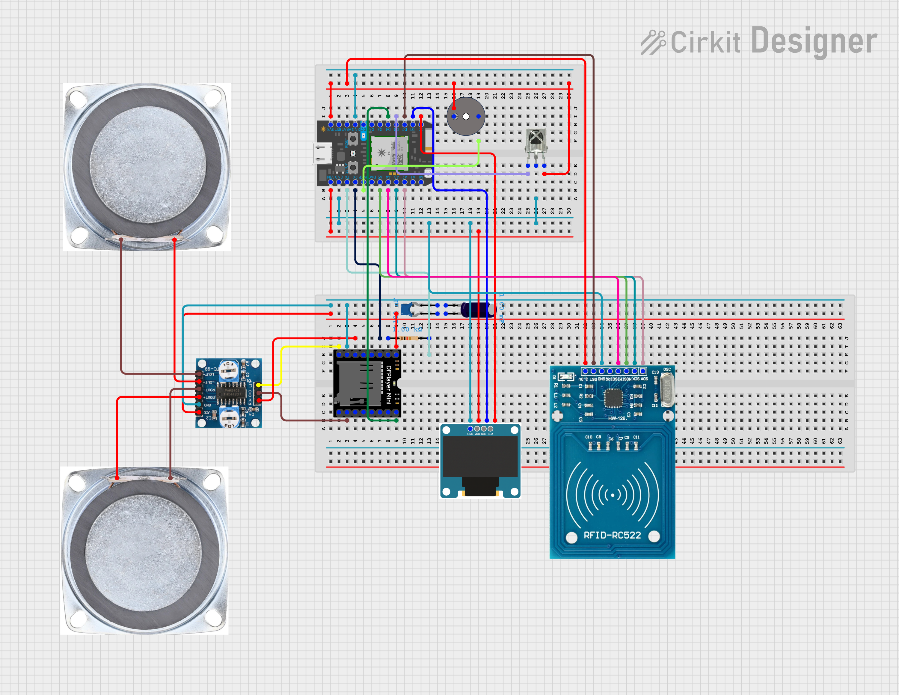

# RFID-Authenticated Mini Music Player with Cloud-Powered Recommendations


<div align="center">
  
  <p><em>A dedicated music player combining RFID authentication with cloud-powered recommendations</em></p>
</div>

---

## 📖 Table of Contents

- [Overview](#-overview)
- [Features](#-features)
- [System Architecture](#️-system-architecture)
- [Hardware Components](#-hardware-components)
- [Installation](#-installation)
- [Cloud Integration](#️-cloud-integration-pipedream-workflow)
- [Usage](#-usage)
- [Project Structure](#-project-structure)
- [Development](#️-development)
- [Contributing](#-contributing)
- [License](#-license)
- [Authors](#-authors)
- [Acknowledgments](#-acknowledgments)

---

## 🎵 Overview

Modern music consumption suffers from **digital fragility** and **smartphone dependency**. This project addresses these challenges through a dedicated, RFID-authenticated music player that combines tangible physical interaction with cloud-powered intelligence.

The device identifies users through **RFID tags**, communicates with a cloud server to fetch **personalized music recommendations**, and plays audio using a miniaturized embedded platform powered by the **Particle Photon microcontroller**. Unlike converged multipurpose devices, it operates independently, ensuring music availability regardless of smartphone status.

### 🔴 Problem Statement

- **Smartphone dependency** leads to interrupted listening experiences
- Lack of **physical engagement** with music diminishes the experience  
- No **personalized offline** music player exists
- Constant **notification interruptions** fragment attention
- Loss of the **focused, ritualistic** act of listening to music

### ✅ Our Solution

- **RFID card authentication** for secure, tangible access
- **Cloud-generated playlists** personalized to user preferences
- **Dedicated portable device** for distraction-free listening
- **Tangible, ritualistic interaction** that enhances engagement
- **Offline operation** with optional cloud connectivity

---

## ✨ Features

- 🔐 **RFID Authentication**: Secure user identification using RFID-RC522 cards
- ☁️ **Cloud Integration**: Personalized music recommendations fetched from cloud server
- 🎮 **IR Remote Control**: Navigate tracks, adjust volume, and control playback wirelessly
- 🖥️ **OLED Display**: Clear 128x64 display showing track info, volume, and system status
- 🔊 **High-Quality Audio**: Stereo output with PAM8406 Class-D amplifier
- 💾 **SD Card Storage**: Local MP3 file playback from microSD card (up to 32GB)
- 🎯 **Direct Track Selection**: Quick access to favorite tracks via remote number buttons
- 📱 **Offline Operation**: Works independently without constant internet connection
- 🔔 **Audio Feedback**: Success/failure tones via piezoelectric buzzer
- 🎨 **Animated UI**: Scrolling text for long track titles, smooth transitions

---

## 🏗️ System Architecture

The system operates through **five interconnected layers** that coordinate authentication, processing, cloud communication, output, and power:

### Architecture Layers

1. **Input Layer**: 
   - RFID reader (MFRC522) for user authentication
   - IR remote receiver (38 kHz) for user control

2. **Processing Layer**: 
   - Particle Photon microcontroller (ARM Cortex-M3 @ 120 MHz)
   - Manages all system logic and coordination

3. **Communication Layer**: 
   - Wi-Fi connectivity for cloud-based recommendations
   - Particle Cloud integration for real-time updates

4. **Output Layer**: 
   - DFPlayer Mini for MP3 decoding and playback
   - OLED display (SSD1306) for user interface
   - Stereo speakers with amplification

5. **Power Layer**: 
   - USB power supply
   - Shared ground for signal stability

### System Workflow

```
1. Scan RFID Card → 2. Authentication → 3. Device Unlocks 
→ 4. Navigate Menu (IR Remote) → 5. Select Track 
→ 6. [Optional] Fetch Cloud Recommendations → 7. Audio Playback
```

### State Machine

The firmware implements a **state-driven architecture** with 5 operational modes:

- `MODE_LOCKED` (-1): Waiting for RFID authentication
- `MODE_SELECT_TRACK` (0): Track selection menu with pagination
- `MODE_NOW_PLAYING` (1): Playback screen with scrolling title
- `MODE_LOADING` (3): Loading animation during cloud requests
- `MODE_RECOMMEND` (2): Display cloud-generated recommendations

---

## 🔧 Hardware Components

### Core Components

| Component | Specification | Function | Connection |
|-----------|---------------|----------|------------|
| **Particle Photon** | ARM Cortex-M3, 120MHz, Wi-Fi | Main microcontroller | - |
| **MFRC522** | 13.56 MHz RFID Reader, 3-5cm range | User authentication | SPI (SS→A2, RST→D2) |
| **DFPlayer Mini** | MP3 decoder, FAT32, DAC output | Audio playback | UART (Serial1, BUSY→D4) |
| **PAM8406** | 5W Class-D Amplifier, 85% efficiency | Audio amplification | From DFPlayer output |
| **SSD1306** | 128x64 OLED, I2C interface | User interface display | I2C (SDA/SCL) |
| **IR Receiver** | 38 kHz, NEC protocol | Remote control input | Digital pin D3 |
| **Speakers (×2)** | 4Ω impedance, 30W power | Stereo audio output | From amplifier |
| **Piezo Buzzer** | 5V active buzzer | Feedback tones | Digital pin A7 |
| **MicroSD Card** | FAT32 format, max 32GB | MP3 storage | In DFPlayer |
| **Electrolytic Capacitor** | 1mF | Smooth out voltage | Breadboard Railways |
| **Ceramic Capacitor** | 100nF | Reduce noise | Breadboard Railways |

**Estimated Total Cost**: Around 220 MAD ($22 USD) excluding speakers and lab-provided components

### Pin Configuration

```cpp
// Particle Photon Pin Assignments
#define PIN_IR_RECV D3        // IR receiver input
#define PIN_DF_BUSY D4        // DFPlayer busy status
#define SS_PIN A2             // RFID SPI slave select
#define RST_PIN D2            // RFID reset
#define BUZZER A7             // Piezo buzzer output

// I2C for OLED (default pins)
// SDA → D0
// SCL → D1

// UART for DFPlayer (Serial1)
// TX → RX (Serial1)
// RX → TX (Serial1)
```

### Circuit Diagram

<div align="center">
  
  <p><em>Complete breadboard circuit showing all connections</em></p>
</div>

---

## 🚀 Installation

### Prerequisites

**Hardware Requirements:**
- All components from list above
- Breadboard
- USB cable (Micro-USB to USB-A) for Particle Photon
- MicroSD card (8GB-32GB, FAT32 formatted)
- Computer with internet connection

**Software Requirements:**
- [Particle Account](https://login.particle.io/signup) (free)
- [Particle Web IDE](https://build.particle.io) or [Particle Workbench](https://www.particle.io/workbench/)
- Optional: [Arduino IDE](https://www.arduino.cc/en/software) for library testing

**Required Libraries:**
- `Adafruit_SSD1306` - OLED display driver
- `MFRC522` - RFID reader library
- `IRremote` - Infrared remote library
- `DFPlayer` - DFPlayer Library

### Hardware Setup

#### Step 1: Assemble the Circuit

Follow the circuit diagram above. Key connections:

**1. RFID Module (MFRC522)**
```
MFRC522 → Particle Photon
─────────────────────────
SDA/SS  → A2
SCK     → A3 (SPI SCK)
MOSI    → A5 (SPI MOSI)
MISO    → A4 (SPI MISO)
IRQ     → Not connected
GND     → GND
RST     → D2
3.3V    → 3V3
```

**2. OLED Display (SSD1306)**
```
OLED    → Particle Photon
─────────────────────────
VCC     → 3V3 or VIN
GND     → GND
SCL     → D1 (I2C SCL)
SDA     → D0 (I2C SDA)
```

**3. DFPlayer Mini**
```
DFPlayer → Particle Photon
──────────────────────────
VCC      → 5V (or 3.3V with voltage drop)
GND      → GND
TX       → RX (Serial1)
RX       → TX (Serial1) via 1kΩ resistor
BUSY     → D4
SPK_1    → To amplifier input +
SPK_2    → To amplifier input -
```

**4. IR Receiver**
```
IR Recv  → Particle Photon
──────────────────────────
VCC      → 3V3
GND      → GND
OUT      → D3
```

**5. Buzzer**
```
Buzzer   → Particle Photon
──────────────────────────
+        → 3.3V
-        → A7
```

**6. Amplifier & Speakers**
```
PAM8406 Amp → Connection
────────────────────────
IN_L     → DFPlayer SPK_1
IN_R     → DFPlayer SPK_2
OUT_L    → Left Speaker
OUT_R    → Right Speaker
VCC      → 5V
GND      → GND
```

#### Step 2: Prepare SD Card

1. **Format** the microSD card as **FAT32**
2. **Copy MP3 files** to the root directory
3. **Rename files** numerically: `001.mp3`, `002.mp3`, `003.mp3`, etc.
4. **Sort files** using [FAT Sorter](https://www.softpedia.com/get/System/File-Management/FAT-Sorter.shtml) tool (Windows)
   - This ensures DFPlayer reads files in correct order
5. **Insert SD card** into DFPlayer Mini slot

#### Step 3: Verify Connections

- [ ] No short circuits between VCC and GND
- [ ] All grounds are connected
- [ ] 3.3V and 5V rails are correct voltage
- [ ] SPI pins have proper connections

### Software Setup

#### Option 1: Particle Web IDE (Recommended for Beginners)

1. **Create Particle Account**
   - Go to [build.particle.io](https://build.particle.io)
   - Sign up or log in

2. **Create New App**
   - Click "Create New App"
   - Name it "RFID_Music_Player"

3. **Add Libraries**
   - Click "Libraries" icon (bookmark symbol)
   - Search and include:
     - `ADAFRUIT_SSD1306`
     - `MFRC522`
     - `IRremote`
     - `DFPlayer`

4. **Copy Firmware Code**
   - Open `src/firmware/musicplayercleancode.cpp`
   - Copy entire contents
   - Paste into Web IDE

5. **Configure Authorized RFID Card**
   - Find this line in code:
   ```cpp
   byte authorizedUID[] = {};
   ```
   - Replace with your card's UID (see testing section)

6. **Flash to Device**
   - Connect Photon via USB
   - Select your device from devices list
   - Click "Flash" (lightning bolt icon)
   - Wait for flashing to complete (LED breathes cyan)

#### Option 2: Particle Workbench (VS Code)

```bash
# Install Particle CLI
npm install -g particle-cli

# Login to Particle
particle login

# Clone repository
git clone https://github.com/Speedylo/rfid-music-player.git
cd rfid-music-player

# Open in VS Code with Particle Workbench extension
code .

# Compile project
particle compile photon src/firmware/

# Flash to device
particle flash YOUR_DEVICE_NAME firmware.bin
```
---

## ☁️ Cloud Integration: Pipedream Workflow

The cloud-powered recommendations feature leverages **Pipedream**, a low-code integration platform, to create a sophisticated workflow that connects your music player to **Spotify API**, **Google Sheets**, and **Discord Rich Presence**.

### Overview

Three main Pipedream workflows handle:

1. **Track Playback** - Logs music activity to Google Sheets and updates Discord status
2. **Recommendations** - Generates personalized suggestions based on listening history
3. **Stop Track** - Clears Discord status when playback ends

### Architecture Diagram

```
┌─────────────────────────────────────────────────────┐
│         RFID Music Player (Particle Photon)         │
│  Publishes Events: PlayTrack | StopTrack | Recs    │
└─────────────────────┬───────────────────────────────┘
                      │
           ┌──────────▼──────────┐
           │   Particle Cloud    │
           │  (Webhooks/Events)  │
           └──────────┬──────────┘
                      │
        ┌─────────────▼─────────────┐
        │  Pipedream Workflows (3)  │
        │  ├─ Track Playback Flow   │
        │  ├─ Recommendations Flow  │
        │  └─ Stop Track Flow       │
        └────┬──────────┬───┬───────┘
             │          │   │
        ┌────▼─┐  ┌─────▼──┐ │
        │Spotify│  │Google  │ │
        │  API  │  │Sheets  │ │
        └───────┘  └────────┘ │
                           ┌──▼─────────┐
                           │Discord RPC │
                           │Bridge (ngrok)
                           └────────────┘
```

### Workflow 1: Track Playback & Logging

**Trigger**: User selects a track via remote

**Steps**:
1. Receive PlayTrack webhook from Particle
2. Lookup track metadata from table
3. Search Spotify for exact track match (get Spotify ID)
4. Log to Google Sheets: `[Timestamp | Track ID | Title | Artist | Spotify ID]`
5. Update Discord Rich Presence with now-playing info

**Example Output**:
- 📊 Google Sheets: Complete listening history for analytics
- 👾 Discord: "🎵 Now Playing: Glorious - Macklemore"

### Workflow 2: Cloud Recommendations (EQ Button)

**Trigger**: User presses EQ button on remote

**Steps**:
1. Receive Recommendations webhook from Particle
2. Fetch last 3 unique tracks from Google Sheets history
3. Request audio features from Spotify API (tempo, energy, danceability, valence)
4. Calculate average features for seed
5. Request similar track recommendations from Spotify based on seed
6. Format recommendations for OLED display (4 songs max)
7. Send back to Particle device via Cloud function
8. Display recommendations on screen with scrolling

### Workflow 3: Stop Track - Clear Discord

**Trigger**: User stops playback (press pause)

**Steps**:
1. Receive StopTrack webhook from Particle
2. Send stop signal to Discord RPC bridge
3. Clear Rich Presence status

**Discord Output**: Status cleared from profile

### Discord RPC Bridge (Local Server)

To display your music on Discord, run a local Node.js bridge:

**Setup** (3 steps):

```bash
# 1. Install dependencies
npm install discord-rpc axios express

# 2. Run bridge server
node app.js
# Output: Discord bridge listening on http://localhost:3000

# 3. Expose with ngrok
ngrok http 3000
# Output: https://your-public-url.ngrok.io
```

**Use ngrok URL** in Pipedream webhooks.

**Bridge Code**:
```javascript
// --- Bridge Application Code (app.js) ---
const express = require('express');
const app = express();
const PORT = 3000; // MUST be the port you use in Pipedream!
const DiscordRPC = require('discord-rpc');

// Replace with the ID you copied from the Discord Developer Portal
const CLIENT_ID = ''; 

app.use(express.json()); // Middleware to parse JSON body

// 1. Initialize Discord RPC
const rpc = new DiscordRPC.Client({ transport: 'ipc' });

// 2. Set up the local server to listen for Pipedream
app.post('/update_discord', (req, res) => {
    const { title, artist, timestamp} = req.body; // Expecting JSON data: {"title": "Song Name", "artist": "Artist Name"}

    let activityTimestamp = null;

    if (timestamp) {
        if (typeof timestamp === 'string') {
            // Date.parse() converts this string directly into a Unix timestamp in milliseconds.
            const parsedMs = Date.parse(timestamp);
            
            // Check if parsing was successful (Date.parse returns NaN on failure)
            if (!isNaN(parsedMs)) {
                activityTimestamp = parsedMs;
                console.log(`Parsed ISO timestamp: ${timestamp} to milliseconds: ${activityTimestamp}`);
            } else {
                console.error(`Failed to parse timestamp string: ${timestamp}`);
            }
        } else if (typeof timestamp === 'number') {
            // Original logic for numerical timestamps (maintains compatibility)
            const tsString = String(timestamp);
            if (tsString.length === 10) {
                activityTimestamp = timestamp * 1000; // Convert seconds to milliseconds
            } else {
                activityTimestamp = timestamp; // Assume it's already milliseconds
            }
        }
    }

    if(title == "Silent Track") {
        rpc.clearActivity()
           .then(() => console.log('Discord status cleared (Music Stopped).'))
           .catch(err => console.error('Error clearing Discord activity:', err));
        
        res.status(200).send({ status: 'Cleared' });
    }
    else if (title && artist) {
        rpc.setActivity({
            details: `Listening to: ${title}`,
            state: `By: ${artist}`,
            // Optional: You can set a start timestamp to show elapsed time
            startTimestamp: activityTimestamp, 
            largeImageKey: 'music_icon', // Requires uploading an asset in the Developer Portal
            instance: false,
        });
        console.log(`Updated Discord status to: ${title} by ${artist}`);
        res.status(200).send({ status: 'Updated' });
    } else {
        res.status(400).send({ error: 'Missing title or artist' });
    }
});

// 3. Connect to Discord
rpc.on('ready', () => {
    console.log('Discord RPC client connected and ready.');
});

rpc.login({ clientId: CLIENT_ID }).catch(console.error);

// 4. Start the server
app.listen(PORT, '0.0.0.0', () => { // Use '0.0.0.0' to allow access from your router/Pipedream
    console.log(`Bridge listening at http://localhost:${PORT}`);
    console.log('Ready to receive data from Pipedream...');
});
```

### Required API Keys

| Service | Setup Link | What You Get |
|---------|-----------|-------------|
| **Particle** | [console.particle.io](https://console.particle.io) | Access token for device control |
| **Spotify** | [developer.spotify.com](https://developer.spotify.com) | Client ID + Secret for API access |
| **Google Sheets** | [console.cloud.google.com](https://console.cloud.google.com) | Service account for logging |
| **Discord** | [discord.dev](https://discord.dev) | Application token for RPC |

### Features Enabled by Cloud

✅ **Personalized Recommendations** - Based on your listening habits  
✅ **Listening History** - Automatic logging in spreadsheet  
✅ **Discord Integration** - Show what you're playing to friends  
✅ **Analytics** - Track most-played songs, listening patterns  
✅ **Extensibility** - Easy to add more services (Slack, IFTTT, etc.)

### Troubleshooting

| Problem | Solution |
|---------|----------|
| Recommendations slow/missing | Check Particle device has Wi-Fi, verify Pipedream workflow is active |
| Discord status not updating | Ensure ngrok tunnel is running (`ngrok http 3000`), bridge server running |
| Spotify not finding tracks | Check track titles in lookup table are accurate |

---

## 📖 Usage

### Basic Operation

#### 1. Power On
- Connect Particle Photon via USB to power source
- Wait 2-3 seconds for system initialization
- OLED displays "LOCKED" screen with "Scan Authorized Card" message

#### 2. Authenticate
- Hold your **authorized RFID card** near the MFRC522 reader (3-5cm range)
- **Success**: Two high-pitched beeps, display shows track selection menu
- **Failure**: One low beep, remains locked (wrong card)

#### 3. Navigate & Select
- Use **IR remote control** to browse and select music
- **CH+/CH-**: Switch between page 1 (tracks 1-4) and page 2 (tracks 5-8)
- **Number buttons (1-8)**: Directly select and play specific track
- **▶/❚❚**: Play or pause current track
- **►❚ / ❚◄**: Next or previous track
- **VOL+/VOL-**: Adjust volume (0-30 levels)

#### 4. Get Recommendations (Optional)
- Press **EQ** button to fetch cloud recommendations
- Display shows "LOADING..." while connecting to cloud
- Recommendations appear with scrolling titles
- Requires Wi-Fi connection

#### 5. Logout
- Press **0** button on remote
- Music stops, system locks
- Returns to "LOCKED" screen

### Remote Control Functions

| Button | Function | Description |
|--------|----------|-------------|
| **CH** | Return to Menu | Go back to track selection screen |
| **CH+** | Next Page | Switch to tracks 5-8 |
| **CH-** | Previous Page | Switch to tracks 1-4 |
| **▶/❚❚** | Play/Pause | Toggle playback |
| **►❚** | Next Track | Skip to next track |
| **❚◄** | Previous Track | Go to previous track |
| **VOL+** | Volume Up | Increase volume by 1 |
| **VOL-** | Volume Down | Decrease volume by 1 |
| **1-8** | Direct Track | Play specific track immediately |
| **EQ** | Recommendations | Fetch cloud suggestions |
| **0** | Logout | Lock device and stop playback |

### Display Modes

The OLED screen shows different interfaces based on system state:

#### 🔒 LOCKED Mode
```
  LOCKED

  Scan Authorized Card
```

#### 📋 TRACK SELECTION Mode
```
  SELECT TRACK (1/2):
  
  1. Glorious - Mackle...
  2. LOST IN THE ECHO...
  3. Am I Dreaming
  4. Tokyo Ghoul OST
```

#### ▶️ NOW PLAYING Mode
```
  PLAYING
  
  Track 5:
  Feather - Nujabes
  Volume: 15 / 30
  [████████░░░░░░░░░░]
```

#### ☁️ RECOMMENDATIONS Mode
```
  RECOMMENDS
  
  Based on listening:
  • Similar Artist 1
  • Genre Match
  • Mood: Chill Vibes
```

#### ⏳ LOADING Mode
```


    LOADING...

```

### Advanced Features

#### Scrolling Text
Long track titles automatically scroll horizontally in a "ping-pong" pattern for readability on the small OLED display.

#### Auto-Advance
When a track finishes, the system automatically advances to the next track using BUSY pin monitoring from the DFPlayer.

#### Volume Persistence
Volume level persists across track changes and playback sessions.

### Track List Configuration

Currently configured tracks (update in `SONG_TITLES[]` array):
1. Glorious - Macklemore
2. LOST IN THE ECHO - Linkin Park
3. Am I Dreaming
4. Tokyo Ghoul OST
5. Feather - Nujabes
6. Holiday - Green Day
7. Number One Bankai
8. Don't Even Try It - Funky DL

To add your own tracks:
1. Copy MP3 files to SD card as `001.mp3`, `002.mp3`, etc.
2. Update `SONG_TITLES[]` array in firmware
3. Update `TOTAL_TRACKS` constant if adding more than 8 tracks
4. Reflash firmware to Photon

### Troubleshooting

**Problem**: Device not responding to RFID
- **Solution**: Ensure card is within 3-5cm range, check RFID wiring

**Problem**: No audio output
- **Solution**: Check volume level (VOL+ to increase), verify speaker connections and amplifier power

**Problem**: Remote not working
- **Solution**: Point directly at IR receiver, check D3 connection

**Problem**: Recommendations not loading
- **Solution**: Verify Wi-Fi connection, check cloud function configuration

**Problem**: SD card not detected
- **Solution**: Ensure FAT32 format, check SD card contacts, verify files are sorted with FAT Sorter

**Problem**: Display shows garbled text
- **Solution**: Check I2C connections (SDA/SCL), verify 3.3V power to OLED

---

## 🛠️ Development

### Firmware Architecture

The firmware is built around a **state machine** that manages five operational modes. The main loop continuously:
1. Checks RFID for authentication (if locked)
2. Processes IR remote commands (if unlocked)
3. Monitors track playback status (BUSY pin)
4. Updates OLED display with animations

### Key Functions

**RFID Authentication**
```cpp
void handleRFID()               // Polls for new RFID cards
bool isAuthorized()             // Validates card UID
void playSuccessTone()          // Audio feedback for success
void playFailTone()             // Audio feedback for failure
```

**Playback Control**
```cpp
int playSong(String num)        // Play specific track
int cloudNext(String command)   // Advance to next track
int cloudPrevious(String)       // Go to previous track
int cloudPause(String command)  // Toggle play/pause
int playTrackInternal()         // Internal playback helper
```

**Volume Management**
```cpp
int cloudSetVolume(String vol)  // Set absolute volume
int cloudIncreaseVolume(String) // Increment volume
int cloudDecreaseVolume(String) // Decrement volume
int cloudGetVolume(String)      // Query current volume
```

**Display Updates**
```cpp
void drawLockedScreen()         // Show LOCKED mode
void drawTrackSelection()       // Show track menu
void drawNowPlaying()           // Show playback screen
void drawLoadingScreen()        // Show loading animation
void animateRecommendations()   // Scroll recommendations
void calculateScroll(...)       // Ping-pong scroll logic
```

**Cloud Communication**
```cpp
void registerCloudFunctions()   // Register Particle functions
int displayRecs(String recs)    // Display cloud recommendations
```

**System Control**
```cpp
int cloudLogout(String)         // Logout and lock system
void resetScrollState()         // Reset UI scroll positions
void checkTrackStatus()         // Monitor BUSY pin for track end
```

### Adding New Features

#### Add New Tracks
1. Update `SONG_TITLES[]` array with track names
2. Update `TOTAL_TRACKS` constant
3. Add corresponding MP3 files to SD card as `00X.mp3`
4. Reflash firmware

#### Change IR Remote Codes
IR codes are defined in the `IR` namespace. To use a different remote:
1. Run IR receiver test to capture your remote's codes
2. Update hex codes in `namespace IR { ... }`
3. Reflash firmware

#### Modify Display Layout
Display functions use Adafruit GFX coordinates:
- Screen size: 128x64 pixels
- Font sizes: 1 (6x8px), 2 (12x16px)
- Modify `drawXXX()` functions to change layouts

**Test RFID Module**
```cpp
#include <MFRC522.h>

#define SS_PIN A2
#define RST_PIN D2

MFRC522 mfrc522(SS_PIN, RST_PIN);

void setup() {
    Serial.begin(9600);
    SPI.begin();
    mfrc522.PCD_Init();
}

void loop() {
    if (mfrc522.PICC_IsNewCardPresent()) {
        if (mfrc522.PICC_ReadCardSerial()) {
            Serial.print("UID:");
            for (byte i = 0; i < mfrc522.uid.size; i++) {
                Serial.print(mfrc522.uid.uidByte[i] < 0x10 ? " 0" : " ");
                Serial.print(mfrc522.uid.uidByte[i], HEX);
            }
            Serial.println();
        }
    }
}
```

### Known Issues & Limitations

1. **DFPlayer Library Limitations**
   - Getter functions (getStatus, getVolume) unreliable
   - Solution: Track state in firmware, use BUSY pin

2. **No True Pause/Resume**
   - DFPlayer lacks true pause capability
   - Solution: Stop and restart track (pseudo-pause)

3. **SD Card File Ordering**
   - DFPlayer reads by FAT table order, not filename
   - Solution: Use FAT Sorter tool after adding files

4. **Small Display Size**
   - Only 128x64 pixels
   - Solution: Pagination + scrolling text

5. **Single User Profile**
   - Only one authorized RFID UID
   - Future: Add multi-user support with database

6. **Cloud Dependency**
   - Recommendations require Wi-Fi
   - Future: Cache recommendations locally

---

## 🤝 Contributing

Contributions are welcome!

### Areas for Improvement

#### Hardware Enhancements
- [ ] Custom PCB design to replace breadboard
- [ ] 3D-printed enclosure/case design
- [ ] Battery operation with power management
- [ ] Larger TFT color display (e.g., 2.8" ILI9341)
- [ ] Volume knob (rotary encoder) for tactile control
- [ ] LED indicators for system status

#### Software Features
- [ ] Multiple user RFID profiles with preferences
- [ ] Playlist management and favorites system
- [ ] Shuffle and repeat playback modes
- [ ] Equalizer presets (bass boost, treble, etc.)
- [ ] Sleep timer functionality
- [ ] Bluetooth audio output option
- [ ] Offline recommendation caching
- [ ] Album art display (if using larger screen)
- [ ] Web interface for configuration

---

## 📄 License

This project is licensed under the **MIT License**.

```
MIT License

Copyright (c) 2025 Younes Rahati

Permission is hereby granted, free of charge, to any person obtaining a copy
of this software and associated documentation files (the "Software"), to deal
in the Software without restriction, including without limitation the rights
to use, copy, modify, merge, publish, distribute, sublicense, and/or sell
copies of the Software, and to permit persons to whom the Software is
furnished to do so, subject to the following conditions:

The above copyright notice and this permission notice shall be included in all
copies or substantial portions of the Software.

THE SOFTWARE IS PROVIDED "AS IS", WITHOUT WARRANTY OF ANY KIND, EXPRESS OR
IMPLIED, INCLUDING BUT NOT LIMITED TO THE WARRANTIES OF MERCHANTABILITY,
FITNESS FOR A PARTICULAR PURPOSE AND NONINFRINGEMENT. IN NO EVENT SHALL THE
AUTHORS OR COPYRIGHT HOLDERS BE LIABLE FOR ANY CLAIM, DAMAGES OR OTHER
LIABILITY, WHETHER IN AN ACTION OF CONTRACT, TORT OR OTHERWISE, ARISING FROM,
OUT OF OR IN CONNECTION WITH THE SOFTWARE OR THE USE OR OTHER DEALINGS IN THE
SOFTWARE.
```

See the [LICENSE](LICENSE) file for full details.

This means you can:
- ✅ Use this project for personal or commercial purposes
- ✅ Modify and distribute the code
- ✅ Include in your own projects
- ✅ Use for educational purposes

You must:
- ⚠️ Include the original copyright notice
- ⚠️ Include the license text

---

### Contact

- 💼 **LinkedIn**: [Younes Rahati](https://www.linkedin.com/in/younes-rahati/)
- 🐙 **GitHub**: [@Speedylo](https://github.com/Speedylo)

Feel free to reach out for:
- Questions about the project
- Collaboration opportunities  
- Technical discussions
- Project feedback

---

## 📊 Project Statistics

- **Development Time**: ~4 weeks (October-December 2025)
- **Lines of Code**: ~800 lines (C++)
- **Components Used**: 8 major modules
- **Project Cost**: ~220 MAD (~$22 USD)
- **Power Consumption**: ~500mA @ 5V (playback)

---

## 🌟 Star History

[](https://github.com/Speedylo/rfid-music-player/stargazers)

If you found this project helpful or interesting, please consider giving it a ⭐ star on GitHub!

---

*Last Updated: December 10, 2025*